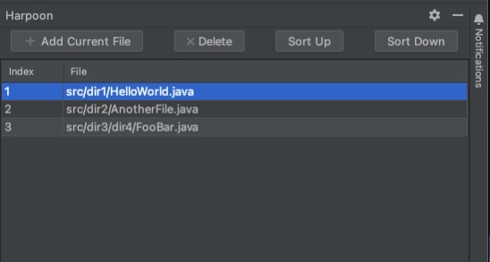

<div align="center">

# Harpoon minimal
##### Getting you where you want with the fewest keystrokes.
###### Inspired by [theprimagen/harpoon](https://github.com/ThePrimeagen/harpoon)

</div>

## The Problem:
<!-- Plugin description -->
If you're implementing a feature you are editing a small amount of files.
With harpoon-minimal you can save these files and navigate via shortcut to them.

The plugin provides a Toolwindow:



In this window you can see the files that were saved. You can also add the currently opened file.
If you select a row in the table(right-click), you can change the sorting of the row or delete the file from harpoon.
Delete only means that the harpoon-marker of the file is deleted not the file itself.
<!-- Plugin description end -->
### Opening the toolwindow
````
First Keystroke: Ctrl + h 
Second Keystroke: o
````

### Adding a file
1. In the toolwindow  
2. via shortcut ```First Keystroke: Ctrl + h``` ```Second Keystroke: a```

### Opening a file
Right-click on a file in the harpoon toolwindow or via Shortcut: 
```
First Keystroke: Ctrl + h
Second Keystroke: <Index of the file> (1-5)
```
e.g. this navigates to file 3
```
First Keystroke: Ctrl + h
Second Keystroke: 3
```

## Open Todos
1. Reacting on changes on the files (e.g. rename or deletion of a file)